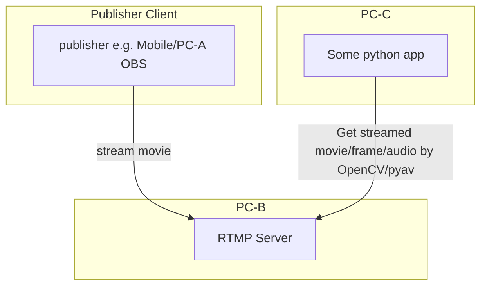
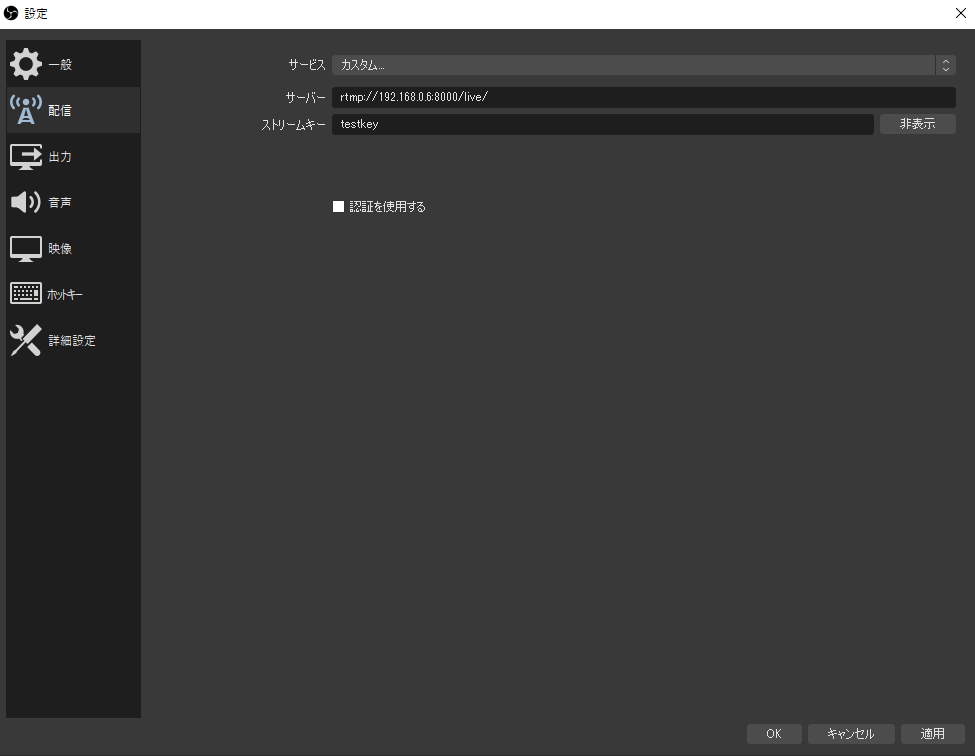

# rtmp-streaming-opencv-capture-test



## 1. Start rtmp streaming server (PC-B)

```bash
$ docker run -d -p [PORT]:1935 --name nginx-rtmp tiangolo/nginx-rtmp
```

## 2. Stream movie from client

e.g. OBS

- settings



e.g. Mobile (Android)

https://github.com/TakuSemba/RtmpPublisher

## 3. Get streaming movie/frame/audio (PC-C)

- movie frame by OpenCV

```python
import cv2
import time

video = cv2.VideoCapture('rtmp://[RTMP Server IP]:[PORT]/live/testkey')

while True:
    rc = video.grab()
    success, image = video.retrieve()
    if image is None:
        time.sleep(0.1)
        continue
    time.sleep(0.1)
```

- movie frame and audio by pyav

```python
import av
import cv2
import numpy as np
import soundfile as sf

container = av.open('rtmp://[RTMP Server IP]:[PORT]/live/testkey')

stream_audio = container.streams.audio[0]

cnt = 500
audio_all = None

for frame in container.decode(video=0, audio=0):
    cnt += 1
    if type(frame) is av.video.frame.VideoFrame:
        img = frame.to_ndarray(format='bgr24')
        # cv2.imwrite('./rtmp_pyav_cap.jpg', img)
        # print(f'img.shape : {img.shape}')
    elif  type(frame) is av.audio.frame.AudioFrame:
        audio = frame.to_ndarray(format='s16')
        audio_all = audio if audio_all is None else np.hstack([audio_all, audio])  # (CHANNEL, N_SAMPLE)  e.g. (2, N) for stereo
        # print(f'audio_all.shape : {audio_all.shape}')
    if cnt > 1000:
        break

sf.write("./rtmp_pyav_cap.wav", audio_all.transpose(), stream_audio.sample_rate, subtype="PCM_16")
```

- raw flv bytes data by librtmp

```python
import librtmp

conn = librtmp.RTMP('rtmp://[RTMP Server IP]:[PORT]/live/testkey', live=True)
conn.connect()
stream = conn.create_stream()

cnt = 0
all_data = None
with open('out.flv', 'wb') as f:
    while cnt < 5000:
        cnt += 1
        data = stream.read(1024)
        if all_data is None:
            all_data = data
        else:
            all_data += data
        f.write(data)
print(all_data[:100])
print(all_data[-100:])
```
