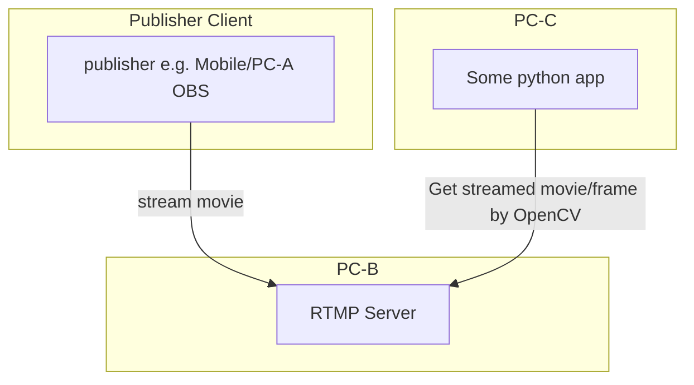

# rtmp-streaming-opencv-capture-test



## 1. Start rtmp streaming server (PC-B)

```bash
$ docker run -d -p [PORT]:1935 --name nginx-rtmp tiangolo/nginx-rtmp
```

## 2. Stream movie from client

e.g. OBS

- settings


## 3. Get streaming movie/frame by OpenCV (PC-C)

```python
import cv2
import time

video = cv2.VideoCapture('rtmp://[RTMP Server IP]:[PORT]/live/testkey')

while True:
    rc = video.grab()
    success, image = video.retrieve()
    if image is None:
        time.sleep(0.1)
        continue
    time.sleep(0.1)
```